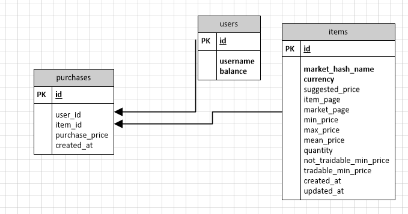

# Тестовое dataLoana

Для работы 2 ендпоинта (api/buy) реализовал скрипт initItems (npm run initItems), который записывает товары в базу  
Покупка происходит по min_price с данных запроса с параметром tradable

## БД
```
CREATE DATABASE data_louna;

CREATE TABLE users (
  id SERIAL PRIMARY KEY,
  username VARCHAR(100) NOT NULL,
  balance DECIMAL(10, 2) DEFAULT 0.0
);

CREATE TABLE items (
  id SERIAL PRIMARY KEY,
  market_hash_name VARCHAR(255) NOT NULL,
  currency VARCHAR(10) NOT NULL,
  suggested_price NUMERIC(10, 2),
  item_page TEXT,
  market_page TEXT,
  min_price NUMERIC(10, 2),
  max_price NUMERIC(10, 2),
  mean_price NUMERIC(10, 2),
  quantity INT,
  not_traidable_min_price NUMERIC(10, 2),
  tradable_min_price NUMERIC(10, 2),
  created_at BIGINT,
  updated_at BIGINT
);

CREATE TABLE purchases (
  id SERIAL PRIMARY KEY,
  user_id INTEGER REFERENCES users(id),
  item_id INTEGER REFERENCES items(id),
  purchase_price DECIMAL(10, 2) NOT NULL,
  created_at TIMESTAMP DEFAULT CURRENT_TIMESTAMP
);
```

  
## Установка

Для установки пакетов

```bash
npm install
```

## Запуск

```bash
npm run start
```


